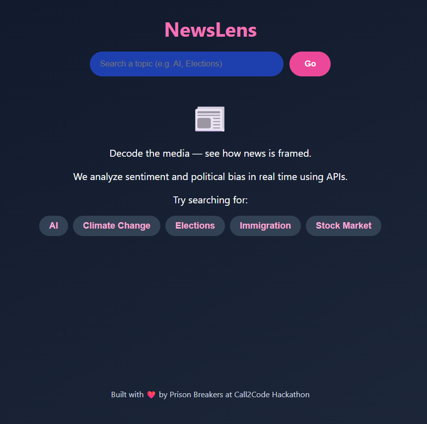
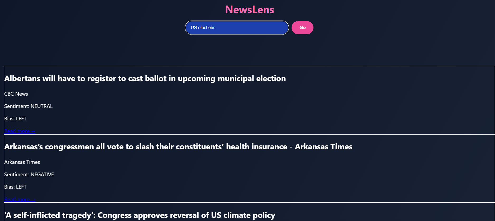

# 📰 NewsLens

**NewsLens** is a real-time news analysis web app that lets users explore how current headlines are framed across different outlets — powered by LLMs and a clean, modern UI.

> 🧠 It analyzes the **sentiment** and **political bias** of news articles using Groq-hosted LLaMA models, helping users decode the tone and narrative behind each headline.

---

## 🌟 Features

- 🔍 Search for any topic and get live headlines from global news sources
- 🎭 Sentiment Analysis: POSITIVE, NEGATIVE, NEUTRAL
- 🏛️ Political Bias Detection: LEFT, CENTER, RIGHT
- 🎨 Color-coded and visually rich cards
- 🚀 Fully responsive, fast, and demo-ready

---

## 🛠️ Tech Stack

| Layer      | Tool / API                 |
|------------|----------------------------|
| Frontend   | React + Vite + CSS         |
| NLP / LLM  | Groq API with LLaMA 3      |
| News Data  | [NewsAPI.org](https://newsapi.org) |
| Hosting    | Netlify                    |
| Git / CI   | GitHub                     |

---

## 🔌 APIs Used

- **NewsAPI** – to fetch real-time global headlines
- **Groq API** – to classify both:
  - 📊 Sentiment
  - 🧭 Political Bias  
  *(using LLaMA 3 model with blazing fast inference)*

---
## 📸 Screenshots

### 🏠 Home Page


### 📑 Results View


---
## 🚀 Getting Started

```bash
git clone https://github.com/your-username/NewsLens.git
cd NewsLens
npm install
npm run dev
